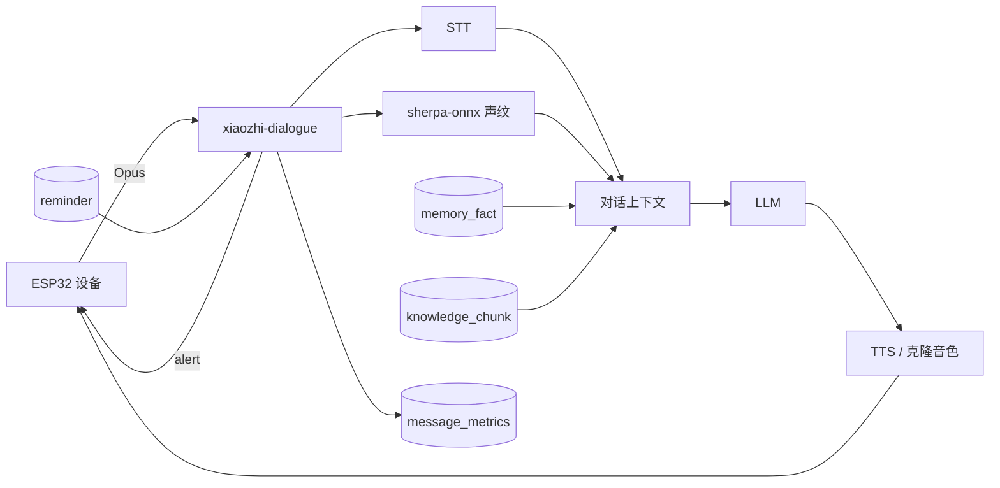

# 个人版 AI 增强功能落地说明

版本：v1.0

日期：2026-07-17
适用范围：个人部署、1～10 台设备、`xiaozhi-server` + `xiaozhi-dialogue`

## 1. 结论

个人版不引入 EMQX、MinIO、Elasticsearch 或独立向量数据库。新增能力复用 MySQL、现有 WebSocket 和本地文件系统：

| 能力 | 实现 | 外部组件 |
|---|---|---|
| RAG 知识库 | Tika 解析、现有 Embedding Provider、MySQL 存向量并内存余弦检索 | 无 |
| 长期记忆 | 结构化事实表、显式 `save_memory` 工具、对话前检索注入 | 无 |
| 声纹识别 | sherpa-onnx 本地 Speaker Embedding、质心注册、阈值和次优差值判定 | 一个 ONNX 模型 |
| 音色克隆 | Provider SPI，支持阿里、火山、MiniMax、小米 MiMo | 对应云 API |
| 数据统计 | 每轮对话记录 STT、LLM、TTS、端到端时延 | 无 |
| 闹钟/主动提醒 | MySQL 调度表、dialogue 单实例轮询、WebSocket `alert` 下发 | 无 |

这套实现针对个人规模。RAG 检索会读取一个角色关联知识库的 chunk 向量，因此设置了每库 2,000 个 chunk 的硬上限；超过该规模再考虑 pgvector、Qdrant 或 Milvus。

## 2. 数据流



## 3. 数据库迁移

Flyway 迁移文件：

- `V12__add_personal_ai_features.sql`

新增表：

- `memory_fact`：长期事实、置信度、来源消息和过期时间。
- `knowledge_base`、`knowledge_document`、`knowledge_chunk`：知识库、原文档和分块向量。
- `voice_profile`：说话人声纹质心与判定阈值。
- `voice_clone`：云端克隆任务、本地私有样本和 Provider 音色 ID。
- `message_metrics`：每轮对话各阶段时延。
- `reminder`、`reminder_delivery`：提醒定义和幂等投递记录。

迁移随 `xiaozhi-server` 启动执行。两个应用必须连接同一个 MySQL 实例。

## 4. 配置

启用 `personal` profile 后，可通过环境变量覆盖：

```yaml
xiaozhi:
  runtime:
    knowledge-dir: ${KNOWLEDGE_DIR:data/knowledge}
    voice-sample-dir: ${VOICE_SAMPLE_DIR:data/voice-samples}
    speaker-embedding-model: ${SPEAKER_EMBEDDING_MODEL:}

personal:
  reminder:
    scheduler-enabled: true
    poll-interval-ms: 1000
  statistics:
    zone: ${STATISTICS_ZONE:Asia/Shanghai}
```

`scheduler-enabled` 只应在 `xiaozhi-dialogue` 为 `true`。`xiaozhi-server` 已固定为 `false`，防止管理进程先抢到提醒任务却没有设备会话可下发。

推荐目录：

```text
data/
├── firmware/
├── knowledge/
└── voice-samples/
models/
└── speaker/
    └── 3dspeaker_speech_campplus_sv_zh-cn_16k-common.onnx
```

声纹模型可从 [sherpa-onnx Speaker ID 模型发布页](https://github.com/k2-fsa/sherpa-onnx/releases/tag/speaker-recongition-models)选择。当前代码按 16 kHz、PCM16LE、单声道输入，推荐 CAMPPlus 中文 16k 模型。模型为空时自动声纹识别明确关闭，服务不会生成伪向量。

## 5. RAG 知识库

### 5.1 处理流程

1. 上传文件，限制 20 MB。
2. 文件名改为服务端 UUID，并校验最终路径仍位于用户目录内。
3. 支持 TXT、Markdown、HTML、JSON、PDF、DOCX。
4. 使用 Tika 的 PDF 和 Microsoft 精确模块解析，不引入完整 `tika-parsers-standard-package`。
5. 按约 1,200 字符分块、150 字符重叠。
6. 使用知识库关联的现有 Embedding 配置生成向量。
7. 对话前取 Top-K 片段，作为独立 SystemMessage 注入。

### 5.2 API

```text
POST   /api/personal/knowledge-bases
GET    /api/personal/knowledge-bases
DELETE /api/personal/knowledge-bases/{knowledgeBaseId}
POST   /api/personal/knowledge-bases/{knowledgeBaseId}/documents
GET    /api/personal/knowledge-bases/{knowledgeBaseId}/documents
POST   /api/personal/knowledge/search
```

知识库可绑定 `roleId`；为空表示当前用户所有角色可用。Embedding 配置必须属于当前用户或系统默认用户。

## 6. 长期记忆

长期记忆不是整段聊天摘要，而是可修正、可删除的结构化事实，例如：

```json
{
  "namespace": "profile",
  "key": "preferred_city",
  "value": "杭州",
  "confidence": 1.0
}
```

当前采用显式写入：LLM 只有在用户明确表达“记住”时调用 `save_memory`。这样避免后台自动抽取把模型推测写成事实。每用户最多 500 条活动事实；相同键的纠正不占新额度。

API：

```text
POST   /api/personal/memories
GET    /api/personal/memories
DELETE /api/personal/memories/{memoryId}
```

每轮对话根据用户当前文本检索最多 10 条相关事实，与 RAG 片段分别注入，不修改历史消息原文。

## 7. 声纹识别

### 7.1 注册

管理端上传 3～10 段音频：

```text
POST /api/personal/voice-profiles/audio
Content-Type: multipart/form-data

files: 至少 3 个 WAV 或裸 PCM 文件
displayName: 说话人显示名
threshold: 可选，默认 0.72
```

每段至少 1 秒，推荐 3～10 秒、安静环境、16 kHz 单声道 PCM16LE。服务分别提取向量，归一化后求质心。

为便于算法调试，仍保留直接提交 embedding 的高级接口：

```text
POST /api/personal/voice-profiles
```

### 7.2 实时识别

STT 完成后，服务复用本轮 VAD 收集的 PCM：

1. 生成 speaker embedding。
2. 只在当前设备所属用户的声纹档案中检索。
3. 最佳分数必须达到档案阈值。
4. 最佳分数与次优分数差必须至少为 `0.03`。
5. 通过后把 `speakerProfileId`、`speakerName`、`speakerScore` 写入消息 metadata。
6. LLM 接收形如 `[说话人:张三]` 的稳定消息前缀。

没有达到阈值时按 `UNKNOWN` 处理，不把猜测身份送给 LLM。

## 8. 音色克隆

统一入口：

```text
POST   /api/personal/voice-clones
GET    /api/personal/voice-clones
POST   /api/personal/voice-clones/{cloneId}/refresh
POST   /api/personal/voice-clones/{cloneId}/preview
DELETE /api/personal/voice-clones/{cloneId}
```

创建任务采用异步提交。样本先写入 `data/voice-samples/{userId}`，数据库记录 SHA-256；API Key 不写入 `voice_clone` 表，继续使用现有 `config` 表。

### 8.1 Provider 配置映射

| Provider | `config.provider` | 认证字段 | 创建参数 | 语义 |
|---|---|---|---|---|
| 阿里云 CosyVoice | `aliyun` | `ak`、`sk` | `sourceUrl` 必填，`requestedVoiceId` 可选前缀 | 云端持久音色 |
| 火山引擎声音复刻 | `volcengine` | `appId`、`apiKey` | `requestedVoiceId` 为控制台 SpeakerID，`sampleText` 可选 | 云端训练任务 |
| MiniMax | `minimax` | `appId` 为 GroupId、`apiKey` | `requestedVoiceId` 可选 | 先上传文件再克隆 |
| 小米 MiMo V2.5 | `mimo` | `apiKey`，`apiUrl` 可选 | 无需任务 ID | 无状态，每次合成携带 Base64 样本 |

MiMo 使用 `mimo-v2.5-tts-voiceclone`，只接受 WAV/MP3，Base64 后不得超过 10 MB。它不是“先训练后获得 voiceId”的服务，因此 `create` 会立即 READY，但每次试听都会读取私有样本并发送给 MiMo。

阿里当前实现对接智能语音交互 CosyVoice OpenAPI，样本 URL 必须能被阿里公网访问。个人局域网部署时不能把 `127.0.0.1` 或内网地址作为 `sourceUrl`。

火山当前实现使用声音复刻 V1 上传/状态接口和 `seed-icl-2.0` 资源 ID。若账号只开通 V3 控制台密钥，需要新增 V3 Provider 或迁移该适配器，不能混用两套鉴权头。

官方协议参考：

- [阿里云 CosyVoice 声音复刻 API](https://help.aliyun.com/zh/isi/developer-reference/cosyvoice-sound-replica-api)
- [火山引擎声音复刻 V3](https://www.volcengine.com/docs/6561/2227958)
- [MiniMax Voice Cloning](https://platform.minimaxi.com/document/Voice%20Cloning?key=66719032a427f0c8a570165b)
- [小米 MiMo V2.5 TTS Voice Clone](https://mimo.mi.com/docs/usage-guide/speech-synthesis-v2.5)

## 9. 数据统计

每轮语音生成一条 `message_metrics`：

- STT 时长。
- LLM 首 Token 时长和完整时长。
- TTS 首音频时长和播放结束时长。
- 端到端时长。
- LLM/TTS Provider。
- 成功状态和错误阶段。

API：

```text
GET /api/personal/statistics/overview?from=2026-07-01&to=2026-07-31
GET /api/personal/statistics/trend?from=2026-07-01&to=2026-07-31
```

统计日期使用 `STATISTICS_ZONE`，耗时使用单调时钟，避免系统时钟校准造成负值。

## 10. 闹钟和主动提醒

API 与 Function Call 都会把用户本地时间结合 IANA 时区转换为 UTC 入库。支持：

- `ONCE`：单次提醒。
- `DAILY`：每天同一当地时间。
- `WEEKLY`：指定星期集合。
- `NEXT_CONNECT`：设备离线时保留，下一次建立 ChatSession 后补发。
- `ONLINE_ONLY`：离线即记为 MISSED。

API：

```text
POST   /api/personal/reminders
GET    /api/personal/reminders
DELETE /api/personal/reminders/{reminderId}
```

调度器通过 `(reminderId, scheduledAt)` 唯一键保证同一计划时间只产生一次投递。设备在线时使用固件已支持的 `alert` 消息，不要求 MQTT。当前固件没有提醒 ACK，所以服务端 `SENT` 表示 WebSocket 下发成功，不代表用户已经听到。

## 11. 构建和验证

项目要求 JDK 21：

```bash
export JAVA_HOME=/path/to/jdk-21
export PATH="${JAVA_HOME}/bin:${PATH}"
mvn -ntp -DskipTests package
```

本次实现已执行全仓编译打包。运行集成测试前需要可用的 MySQL、Redis、Embedding Provider，以及与部署平台匹配的 sherpa-onnx native library。

## 12. 个人版容量边界

| 项目 | 默认边界 |
|---|---:|
| 设备 | 10 台以内 |
| 长期记忆 | 每用户 500 条活动事实 |
| 知识库 chunk | 每库 2,000 条 |
| 知识文档 | 单文件 20 MB |
| 声纹注册样本 | 3～10 段 |
| 音色样本 | 服务层 20 MB；Provider 可能更小 |
| 统计查询 | 最长 366 天 |

边界内不需要 EMQX 和 MinIO。只有出现跨进程主动推送、对象文件规模持续增长、RAG chunk 达到数万级或多节点部署时，才有理由引入对应组件。
