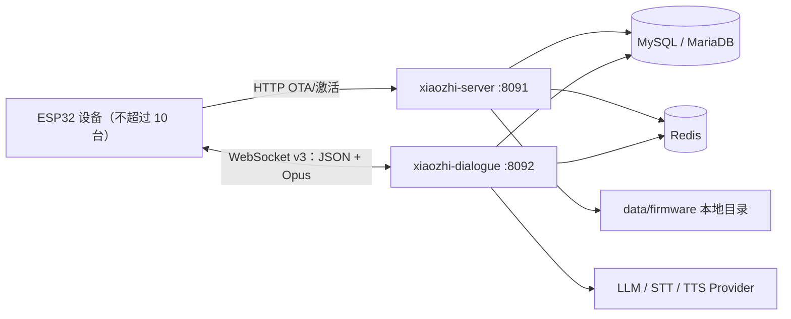

# 小智个人部署优化设计文档

作者：项目维护者

版本：v1.1

日期：2026-07-17
状态：核心个人版已实现

## 一、需求背景

本方案面向个人部署，目标设备为 `atk-dnesp32s3-box2-wifi`，设备总量不超过 10 台。后端使用 `xiaozhi-esp32-server-java`，固件使用 `xiaozhi-esp32`。

设计目标：

1. 支持目标固件实际使用的协议和功能。
2. 降低部署组件数量、内存占用和个人维护成本。
3. 不引入当前规模不需要的 EMQX、MinIO 和集群组件。
4. 保留后续扩展 MQTT 主动推送、知识库等功能的接口边界。

本方案不以“补齐商业版功能列表”为目标。商业功能中，RAG、长期记忆、音色克隆、声纹和情感分析属于后端增强能力，不要求固件存在同名模块；是否启用应由个人需求和服务器资源决定。

## 二、核心原则

1. **固件协议优先**：以 `xiaozhi-esp32` 当前源码和协议为事实来源。
2. **单机优先**：10 台以内不为未来集群预付复杂度。
3. **按需启用**：默认只加载实际使用的 LLM、STT、TTS Provider。
4. **不伪造能力**：没有真实固件文件时，OTA 响应不得返回 `firmware`。
5. **稳定 URL**：OTA 固件使用后端稳定下载地址，不使用会过期的预签名 URL。
6. **可回退**：WebSocket 协议版本可配置为 v1、v2 或 v3，默认使用 v3。

## 三、范围与约束

### 3.1 目标范围

- 设备数量：1～10 台。
- 设备类型：`atk-dnesp32s3-box2-wifi`。
- 部署模式：单台 x86_64 或 ARM64 Linux 主机。
- 网络模式：优先家庭局域网；公网访问时增加 HTTPS/WSS 和设备鉴权。
- 对话传输：WebSocket v3。
- 固件存储：服务器本地文件系统。

### 3.2 硬件能力约束

目标板型没有摄像头，不在固件白名单中支持设备端 AEC，默认也未启用 `CONFIG_RECEIVE_CUSTOM_MESSAGE`。

因此个人部署默认：

- 不展示拍照识图入口。
- 不启用设备端 AEC。
- 不下发 `custom` 消息。
- 服务端 AEC 默认关闭；如后续定制固件启用 `CONFIG_USE_SERVER_AEC`，再单独联调。

## 四、总体架构



### 4.1 组件决策

| 组件 | 决策 | 原因 |
|------|------|------|
| `xiaozhi-server` | 保留 | 管理 API、设备绑定和 OTA |
| `xiaozhi-dialogue` | 保留 | WebSocket、音频和 AI 对话 |
| MySQL/MariaDB | 保留 | 当前 MyBatis、Flyway 和 SQL 使用 MySQL 语义 |
| Redis | 暂时保留 | 认证、Redisson 和跨进程状态已有依赖 |
| EMQX | 不部署 | 当前没有主动唤醒需求，WebSocket 足够 |
| MinIO | 不部署 | 本地固件体量小，文件系统更简单 |
| Nginx/Caddy | 局域网可省略 | 公网部署时才用于 TLS 和反向代理 |

不建议当前合并两个 Spring Boot 应用。合并会扩大改动面，对 10 台设备带来的资源收益有限。

## 五、功能裁剪

### 5.1 默认保留

| 功能 | 状态 | 说明 |
|------|------|------|
| 设备激活与绑定 | 保留 | 固件 OTA 激活流程依赖 |
| WebSocket v1/v2/v3 | 保留 | 默认向设备下发 v3 |
| Opus 音频上下行 | 保留 | 对话核心链路 |
| LLM/STT/TTS | 保留 | 只启用选定 Provider |
| 实时打断 | 保留 | 保留现有 `abort`、VAD 和播放中止逻辑 |
| MCP 设备控制 | 保留 | 现行固件 IoT 控制协议 |
| 角色切换 | 保留 | 可通过语音和管理端使用 |
| 聊天记录与摘要 | 保留 | 个人使用成本低 |
| 本地 OTA | 规划实施 | 替代 MinIO |
| `system/reboot`、`alert` | 保留 | 固件现行下行消息 |

### 5.2 删除或隐藏

| 功能 | 处理 | 原因 |
|------|------|------|
| Legacy `type: "iot"` | 已删除 | 固件已废弃，MCP 替代 |
| 摄像头/拍照识图 | 对 BOX2 隐藏 | 目标硬件无摄像头 |
| Custom Message | 默认关闭 | 目标固件未启用 |
| 多节点负载均衡 | 不启用 | 单机部署不需要 |
| 集群监控大盘 | 不实施 | 10 台设备收益过低 |
| MQTT+UDP | 暂缓 | 当前不需要主动后台推送 |

### 5.3 可选后端增强

以下能力不应因为固件没有同名模块而删除，但默认不加载：

- RAG 知识库。
- 长期记忆和关键信息提取。
- 声纹识别。
- 音色克隆。
- 情感分析。
- MCP Server/SSE 外部接入。
- 语音提醒和闹钟。

## 六、本地 OTA 设计

### 6.1 文件布局

```text
data/
└── firmware/
    └── atk-dnesp32s3-box2-wifi/
        ├── 2.3.0.bin
        └── 2.3.1.bin
```

数据库只保存相对路径，例如：

```text
atk-dnesp32s3-box2-wifi/2.3.1.bin
```

禁止在数据库中保存临时绝对 URL或预签名 URL。下载地址由统一服务根据发布记录生成。

### 6.2 数据库设计

建议新增迁移文件：

```text
xiaozhi-server/src/main/resources/db/migration/V11__add_firmware_release.sql
```

建议表结构：

```sql
CREATE TABLE firmware_release (
    id              BIGINT PRIMARY KEY AUTO_INCREMENT,
    board_type      VARCHAR(100) NOT NULL,
    version         VARCHAR(32)  NOT NULL,
    file_path       VARCHAR(500) NOT NULL,
    file_size       BIGINT       NOT NULL,
    sha256          CHAR(64)     NOT NULL,
    force_update    TINYINT      NOT NULL DEFAULT 0,
    enabled         TINYINT      NOT NULL DEFAULT 1,
    created_at      DATETIME     NOT NULL,
    updated_at      DATETIME     NOT NULL,
    UNIQUE KEY uk_firmware_board_version (board_type, version)
);
```

### 6.3 上传流程

1. 管理端提交 `.bin` 文件、板型、版本号和是否强制升级。
2. 后端校验扩展名、最大文件大小、板型白名单和 SemVer 格式。
3. 后端计算 SHA-256 和文件大小。
4. 文件先写入同目录临时文件。
5. 写入完成并校验后，原子重命名为最终文件名。
6. 数据库事务写入发布记录。
7. 上传失败时删除临时文件，不创建启用的发布记录。

文件名不能直接使用用户输入，防止路径穿越。最终路径由后端通过 `board_type + version` 生成。

### 6.4 OTA 检查

现有接口：

```text
GET/POST /api/device/ota
```

处理规则：

1. 从设备请求体读取 `board.type` 和 `application.version`。
2. 只查找相同 `board_type` 且 `enabled=1` 的发布记录。
3. 使用 SemVer 比较版本，禁止字符串字典序比较。
4. 没有更高版本时，不返回 `firmware` 字段。
5. 有新版本时返回固件可直接下载的稳定 URL。

示例响应：

```json
{
  "websocket": {
    "url": "ws://192.168.1.10:8092/ws/xiaozhi/v1/",
    "token": "",
    "version": 3
  },
  "server_time": {
    "timestamp": 1784196000000,
    "timezone_offset": 480
  },
  "firmware": {
    "version": "2.3.1",
    "url": "http://192.168.1.10:8091/api/device/firmware/12/download",
    "force": 0
  }
}
```

### 6.5 固件下载

建议接口：

```text
GET /api/device/firmware/{releaseId}/download
```

响应要求：

- `Content-Type: application/octet-stream`。
- 必须返回准确的 `Content-Length`。
- 文件不存在或记录未启用时返回 404。
- 流式读取文件，禁止一次性加载整个固件到 JVM 堆。
- 不暴露服务器真实文件路径。
- 局域网模式使用稳定直链；公网模式使用设备级鉴权或短期下载令牌。

## 七、运行资源优化

### 7.1 建议主机规格

使用云端 LLM、STT、TTS 时，建议从以下规格开始：

```text
CPU：2 核
内存：4 GB
磁盘：20 GB 以上
```

如果在本机运行 LLM 或大型语音模型，本资源预算不成立，应根据模型单独规划。

### 7.2 JVM 建议

```text
xiaozhi-server:
  -Xms128m
  -Xmx384m

xiaozhi-dialogue:
  -Xms256m
  -Xmx1024m
```

`xiaozhi-dialogue` 使用原生音频和模型库，除了 JVM 堆外还需要预留本地内存，不能把主机剩余内存全部分配给 `-Xmx`。

### 7.3 数据库与 Redis

建议配置：

```yaml
spring:
  datasource:
    hikari:
      minimum-idle: 1
      maximum-pool-size: 10
```

Redis 建议限制在 64～128 MB。MySQL/InnoDB buffer pool 可从 256～512 MB 起步。

### 7.4 WebSocket

```yaml
websocket:
  max-text-message-buffer-size: 65536
  max-binary-message-buffer-size: 131072
  max-session-idle-timeout: 60000

xiaozhi:
  websocket:
    protocol-version: 3

aec:
  enabled: false
```

WebSocket v3 的负载长度字段为 16 位，单帧最大 65535 字节；128 KB 二进制缓冲已保留足够边界空间。

### 7.5 AI Provider

个人部署只配置实际使用的一套 Provider：

- 一个 LLM Provider。
- 一个 STT Provider。
- 一个 TTS Provider。
- 一个 Embedding Provider，仅在启用 RAG 时需要。

未选中的本地模型和原生运行库不得在启动时初始化。后续可通过 Maven Profile 或 Spring 条件装配进一步缩小发布包，但不在第一阶段删除 Provider 源码。

## 八、安全设计

### 8.1 局域网模式

- 服务端端口只监听可信局域网。
- 路由器不做公网端口映射。
- 固件下载 URL 可使用固定直链。
- 管理端仍保留用户登录和权限校验。

### 8.2 公网模式

- OTA 使用 HTTPS，音频通道使用 WSS。
- OTA 为已绑定设备签发短期设备 Token。
- WebSocket 握手校验 `Authorization`、`Device-Id` 和 `Client-Id`。
- Token 必须绑定设备，不允许不同设备复用。
- 固件下载使用设备鉴权或短期下载令牌，不公开本地存储目录。

## 九、实施计划

### 阶段一：个人配置档

- [ ] 新增 `personal` Spring Profile。
- [ ] 默认 WebSocket v3。
- [ ] BOX2 默认关闭服务端 AEC 和 custom message。
- [ ] 限制 HikariCP、WebSocket 缓冲和日志保留周期。
- [ ] 固定单台 dialogue 服务地址。

### 阶段二：本地 OTA

- [ ] 新增 `firmware_release` 表和 Flyway 迁移。
- [ ] 新增固件上传、发布、禁用和删除接口。
- [ ] 新增安全文件落盘服务。
- [ ] 新增固件流式下载接口。
- [ ] OTA 检查接入板型和 SemVer 匹配。
- [ ] OTA 成功后支持向在线设备发送 `system/reboot`。

### 阶段三：鉴权和稳定性

- [ ] 增加设备级 WebSocket Token。
- [ ] 增加非法二进制帧、错误板型和降级攻击测试。
- [ ] 模拟 10 台设备持续连接和并发对话。
- [ ] 验证进程重启后设备可重新连接。

### 阶段四：按需能力

仅在明确需要时实施：

- MQTT 主动提醒：优先 Mosquitto，不使用 EMQX。
- RAG 和长期记忆。
- 声纹或音色克隆。
- 公网 TLS、域名和反向代理。

## 十、测试与验收

### 10.1 协议测试

- [ ] WebSocket v1、v2、v3 上下行 Opus 均可解码。
- [ ] v2/v3 声明长度与实际长度不一致时关闭连接。
- [ ] `hello`、`listen`、`abort`、`mcp` 消息可正常处理。
- [ ] `stt`、`llm`、`tts`、`mcp`、`system`、`alert` 可正常下发。
- [ ] 后端不再发送或接收 legacy `type: "iot"`。

### 10.2 OTA 测试

| 测试场景 | 预期结果 |
|----------|----------|
| 没有固件记录 | 响应不包含 `firmware` |
| 板型不匹配 | 响应不包含 `firmware` |
| 当前版本等于最新版本 | 响应不包含 `firmware` |
| 存在更高数字点分版本 | 返回对应发布记录 |
| 固件文件丢失 | 下载接口返回 404，不下发无效升级 |
| 下载固件 | `Content-Length` 与文件大小一致 |
| 上传中断 | 不产生启用的固件记录和半成品正式文件 |

### 10.3 容量验收

- [ ] 10 台设备同时建立 WebSocket 连接。
- [ ] 10 台设备轮流进行连续对话，无会话串线。
- [ ] 2 台设备同时对话时无明显音频阻塞。
- [ ] 空闲状态下内存稳定，无持续增长。
- [ ] 运行 24 小时无会话、线程和文件句柄泄漏。
- [ ] 单台设备断网重连不影响其他会话。

## 十一、风险与边界

| 风险 | 影响 | 缓解措施 |
|------|------|----------|
| 本地磁盘损坏 | 固件文件丢失 | 定期备份 `data/firmware` 和数据库 |
| OTA 文件与数据库不一致 | 设备升级失败 | 发布前校验文件存在、大小和 SHA-256 |
| 公网暴露固定下载 URL | 固件被未授权下载 | 使用设备鉴权或短期下载令牌 |
| Redis 被直接删除 | 登录和服务状态异常 | 第一阶段保留 Redis，仅限制资源 |
| 同时加载多个本地模型 | 内存不足 | 按配置条件初始化 Provider |
| WebSocket 无法后台主动推送 | 闹钟和主动提醒不可用 | 明确需要后再引入 Mosquitto |

## 十二、当前完成状态

截至 v1.1，代码已经完成：

- WebSocket v1/v2/v3 音频帧编解码。
- OTA 固件原生响应结构。
- 默认下发 WebSocket v3。
- 删除伪造固件版本和错误下载地址。
- 删除 legacy IoT 链路，设备控制统一使用 MCP。
- 增加 `system/reboot` 和 `alert` 下行消息。
- 新增协议和 OTA 契约测试。
- 新增 `firmware_release` 表和固件管理权限。
- 新增固件管理页面，支持发布、查询、启停、下载和删除。
- 新增本地固件原子写入、SHA-256、大小和路径校验。
- OTA 按 `board.type` 和固件兼容版本规则选择最高版本。
- 固件文件丢失时停止 OTA 下发，下载响应提供准确 `Content-Length`。
- 新增 `personal` 配置档：小连接池、关闭服务端 AEC、限制 WebSocket 缓冲区。
- 新增 `docker-compose-personal.yml`，持久化固件并降低个人部署资源额度。

尚未完成：

- 设备级 WebSocket Token。
- 10 台设备容量测试。

### 12.1 启动个人版

Docker 部署使用叠加配置，不会启动 EMQX 或 MinIO：

```bash
docker compose -f docker-compose.yml -f docker-compose-personal.yml up -d
```

直接运行 Java 时，`xiaozhi-server` 和 `xiaozhi-dialogue` 都应激活 `personal`：

```bash
java -jar xiaozhi-server.jar --spring.profiles.active=personal
java -jar xiaozhi-dialogue-exec.jar --spring.profiles.active=personal
```

可通过 `FIRMWARE_STORAGE_PATH` 修改固件根目录。默认路径为 `data/firmware`。首次启动时 Flyway 自动执行 `V11__add_personal_firmware_release.sql`。

> 数据库迁移前应备份 MySQL；回滚时先停服务，再恢复数据库备份和 `data/firmware` 目录。不要直接删除 Flyway 历史记录。

### 12.2 固件发布规则

1. 管理端进入“固件管理”，板型填写设备实际上报的 `board.type`；目标设备为 `atk-dnesp32s3-box2-wifi`。
2. 版本只允许 2～4 段数字，例如 `1.6.0`。固件源码不支持 `v1.6.0`、`1.6.0-rc.1`。
3. 文件必须为 `.bin`，默认最大 16MB。
4. 同一板型和版本只能发布一次；文件按 `<boardType>/<version>.bin` 保存。
5. OTA 只返回已启用、文件存在、板型一致且高于设备当前版本的最高版本。
6. 已启用固件不能删除，必须先禁用，避免 OTA URL 在升级途中失效。

## 文档版本历史

| 版本 | 日期 | 作者 | 说明 |
|------|------|------|------|
| v1.1 | 2026-07-17 | 项目维护者 | 实现本地固件 OTA、管理页面和个人部署配置 |
| v1.0 | 2026-07-16 | 项目维护者 | 个人部署优化初稿 |
